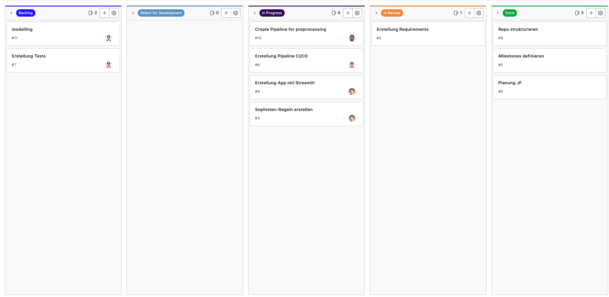
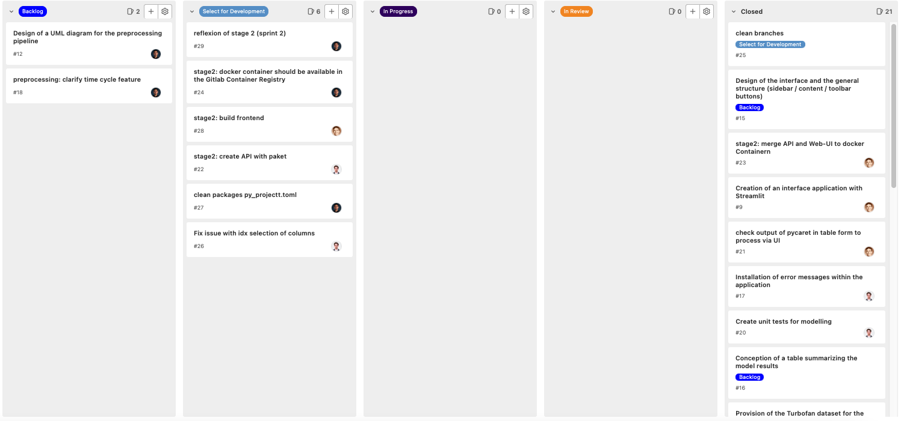

# Frunch_Infinity

## Project attendees
- Kainz Fabian
- Mayr Niklas
- Mitic Dalibor

## Documentation
[Gitlab Pages](https://dalibor.mitic.pages.web.fh-kufstein.ac.at/se2_project/src)

## Goal

The goal of the project: Frunch_Infinity is, to develope an Auto-ML application with interfaces for time-series-tasks. By using this app a Non-Data Scientist can select a dataset that contains time-series via the app and compare the output of different models. Therefore, the user can get first insights if the data which has been used is usable or not. The vision of this project is to falsify the No Free Lunch Theorem.


## Brainstorm

- data set: Turbofan 
- set-up a pipeline (at the beginning start with 2 steps (e.g. scaling, delete NaN) -> incl. CI/CD
- PyCaret could be used, as it has 17 different algorithms that it is using 
- Data set should be selected via the application 
- set-up an interface between PyCaret-Output and the application 
- streamlit, plotlydash should be used for the application 

## Requirements
- Functional:
  - When the Turbofan dataset is imported within the Streamlit app, the application must fully recognize all variables and values of the dataset
  - When the user accesses the application, a choice of available datasets is presented on the user interface
  - If a selection of different datasets is provided in the app, the corresponding dataset must be imported in the data folder of the Frunch      Infinity Gitlab repository
  - When the user runs the "Free Lunch" function (Auto Machine Learning process) within the application, the pipeline must be able to prepare the selected dataset for model training
  - When the selected dataset is passed to the pipeline, the pipeline has to be able to remove missing values
  - When the selected dataset is passed to the pipeline, the pipeline must be capable of scaling the relevant features
  - Once the pipeline has preprocessed the selected data set, several statistical models should be trained on the data to make the training results comparable
  - When the training of the models is completed, a table with the model results must be displayed within the user interface
  - If errors occur while running the Frunch function, the errors should be visible on the app's interface to facilitate the debugging for app-developers


- Technological

- Quality of Service


- User Interface:
  - If the user starts the app, they have to be able to select a data set from an available list.
  - When the models finish the training a summary table must be created showing all results of the models.
  - When the user is starting the free lunch function and any errors occur from the code, those erros should be displayed via the app to the user for debugging. 

- Requirements related to other results

- Requirements for activities


## Reflection stage 1
In stage 1 the requirements have been defined for this project using the SOPHISten rules. Based on the requirements the development of following work packages has started:
- dev-container has been created
- pipeline for preprocessing of the data based on the turbofan dataset 
  - pipeline selects a sensor as output and performs preprocessing on the input features
- CI/CD pipeline has been created
- unit tests have been created for the pipeline testing
- web-app / UI via streamlit started and postponed for stage 2
- model development has been started using pycaret 

During our first sprint, we worked on several topics at the same time. At the beginning of the project, the team had to form and agree an the same project outcome and requirements. It helped us to focus on smaller requirements first an move on to more complicated requirements later on. Step-by-step requirements were added and and will be added throughout the process. Retrospectively, it can be argued that we startet working on our code base a little bit too early. Not all requirements were completely clear and the interfaces between different parts of the software were still to be discussed.
After defining the project scope and outcome, we startet with our development setup. Meanwhile, we also implemented our first requirements. This act of balance was extremely difficult, because a consistent and working setup is the foundation of an efficient implementation. Out team was not always completely consistent with development practices and so it happend that working on different branches and merging resulted in conflicts that had to be resolved. Especially different versions of the same packages were difficult to handle.
Also, our CI/CD Pipeline was not ready at the implementation. Therefore, our first requirements were implemented and validated a little bit later, when our pipeline was ready. A well-definied setup would have helped us during this stage. Coding standards, and defined interfaces are additional learnings from this stage. A topic that still needs a little bit focus and discussion is refactoring and the updating of our CI/CD pipeline. When creating a new feature branch the pipeline and tests should already be in place. Otherwise, validation of development only happens at the final merge which makes refactoring and improving the code more difficult. We therefore argue that moving forward the developer implementing a feature is also resposible for implementing the tests and pipeline.
Working together in person or sync the progress in online meetings is really benefitial for the overall progress. It helped ou team to refocus, improve our code and refine our requirements. Having daily standups in agile development enviroments makes sense, yet, besides working full time, it is not possible for our team to connect on a daily basis. Having a common understanding of objectives and the code is the key to project success and good software is the result of good teamwork - everyone writes their own code and how to write an "if" statement can be googled but how to work in a team is best learned by doing. We are happy with our progress in sprint 1 and know what to focus on in sprint 2.

## Sprint 1 Backlog



## Reflection stage 2
After the release of V0.1 the following workpackages have been defined to work on in stage 2: 
- Development of WEB-APP via streamlit (build frontend)
- Development of API and merge with Web-UI in docker container
- Creation of container images and added to container registry 
- Testing has been extenden for the whole code (test coverage)

As with the process in stage 1, we kept our weekly meetings to check-in our updates, discuss any challenges and support each other. The dockerfile has been created using the course material and the dependencies for the build stage have been reduced to the needed amount. At the beginning of the stage 2 sprint you get overwhelmed with the amount of frameworks and tools that exists and can be used for our project. It was difficult to understand how the tools are dependent from each other and when to use which tool. Retrospectively, to understand the tools and when to use them, you must use them. One additional learning was also to keep the branches clean. We used at one point an old branch and spent a lot of time for debugging. We saw that we were using an old branch, because it was named similar to the new one. Here, it is important to keep the branches clean and the names should follow a defined convention to keep them consistent. With streamlit it was very simple to create the web-app for Frunch-Infinity, as it is very user friendly. At the end we also updated the repo structure. Here, the models and notebooks folder have been deleted, as there are not used within our project. The models folder is normally used to store the trained model after training it on a dataset. As the goal of Frunch-Infinity is to have a simple way to train basic regression models on a given dataset it creates each time a new model, which will not be saved. Therefore, also the models folder from the cookiecutter template is not needed. 

## Sprint 2 Backlog


## Tools used in this project
* [Poetry](https://towardsdatascience.com/how-to-effortlessly-publish-your-python-package-to-pypi-using-poetry-44b305362f9f): Dependency management - [article](https://towardsdatascience.com/how-to-effortlessly-publish-your-python-package-to-pypi-using-poetry-44b305362f9f)
* [hydra](https://hydra.cc/): Manage configuration files - [article](https://towardsdatascience.com/introduction-to-hydra-cc-a-powerful-framework-to-configure-your-data-science-projects-ed65713a53c6)
* [pre-commit plugins](https://pre-commit.com/): Automate code reviewing formatting  - [article](https://towardsdatascience.com/4-pre-commit-plugins-to-automate-code-reviewing-and-formatting-in-python-c80c6d2e9f5?sk=2388804fb174d667ee5b680be22b8b1f)
* [pdoc](https://github.com/pdoc3/pdoc): Automatically create an API documentation for your project
* [streamlit](https://streamlit.io): Streamlit turns data scripts into shareable web apps in minutes. 
* [pycaret] (https://pycaret.gitbook.io/docs/): An open-source, low-code machine learning library in Python


## Project structure
```bash
.
├── config                      
│   ├── main.yaml                   # Main configuration file
│   ├── model                       # Configurations for training model
│   │   ├── model1.yaml             # First variation of parameters to train model
│   │   └── model2.yaml             # Second variation of parameters to train model
│   └── process                     # Configurations for processing data
│       ├── process1.yaml           # First variation of parameters to process data
│       └── process2.yaml           # Second variation of parameters to process data
├── data            
│   ├── final                       # data after training the model
│   ├── processed                   # data after processing
│   ├── raw                         # raw data
│   └── raw.dvc                     # DVC file of data/raw
├── docs                            # documentation for your project
├── dvc.yaml                        # DVC pipeline
├── .flake8                         # configuration for flake8 - a Python formatter tool
├── .gitignore                      # ignore files that cannot commit to Git
├── Makefile                        # store useful commands to set up the environment
├── .pre-commit-config.yaml         # configurations for pre-commit
├── pyproject.toml                  # dependencies for poetry
├── README.md                       # describe your project
├── src                             # store source code
│   ├── __init__.py                 # make src a Python module 
│   ├── process.py                  # process data before training model
│   └── train_model.py              # train model
└── tests                           # store tests
    ├── __init__.py                 # make tests a Python module 
    ├── test_process.py             # test functions for process.py
    └── test_train_model.py         # test functions for train_model.py
```

## Set up the environment
1. Install [Poetry](https://python-poetry.org/docs/#installation)
2. Set up the environment:
```bash
make activate
make setup
```

## Install new packages
To install new PyPI packages, run:
```bash
poetry add <package-name>
```

# Auto-generate API documentation

To auto-generate API document for your project, run:

```bash
make docs
```

